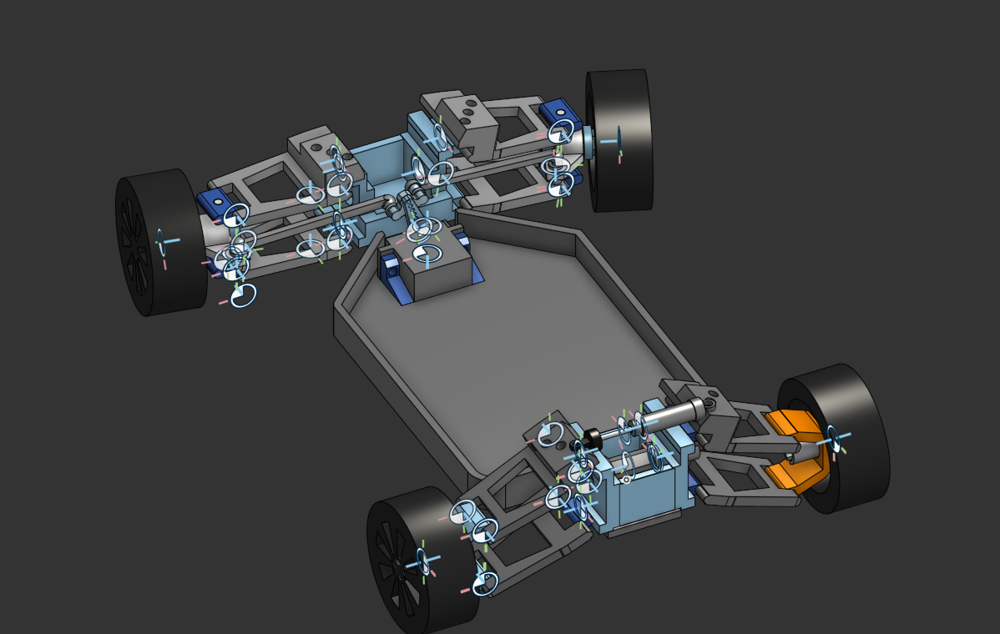

# Rc Crawler.

### A configurable RC Car chasis and setup. 
(Currently in testing phase)

## Goal

Design an adjustable rc car chasis, starting with the suspension. 
Aimeing to be fully adjustbe, (Camber, Toe, Ackerman steering etc)

## Design Requirements

- 3D printable
- Durable
- Adjustable
- Easy to assemble

---

## Version History

### V3
Finished front block design and created chassis. 
 - Tested limits of steering hubs, knuckles, and suspension links.
 - Created mount for MG90s; metalgear servo
 - Refined rear suspension linkages
 - Designed new print in place ball joints. (yet to be tested)

### V2

Animated/rigged the assembly and tested for physical limits in onshape.
Works as expected and has quite a good amount of range however could you some refinement.

#### v1.5
I made some improvents about the linkages and wheel knuckles.
 - Strenghtened knuckles.
 - Increased printing efficiency and strength of the top/bottom arms
 - Added placeholder wheels/hexagonal hubs.
 - Animated wheels/hubs.
 - Designed whishbones and cups for transferring power through the suspension.

To do:
Animate wishbones to slide in the cups
test power transfer through wishbones.

### V1

 - Created basic suspension linkage for rear.

Currently not adjustable or meeting any requirements but it will likey work as basic test.

## Future Work

- finish body
- test front block
- design Diffs/Power system.
- FEA strength test chasis
  
